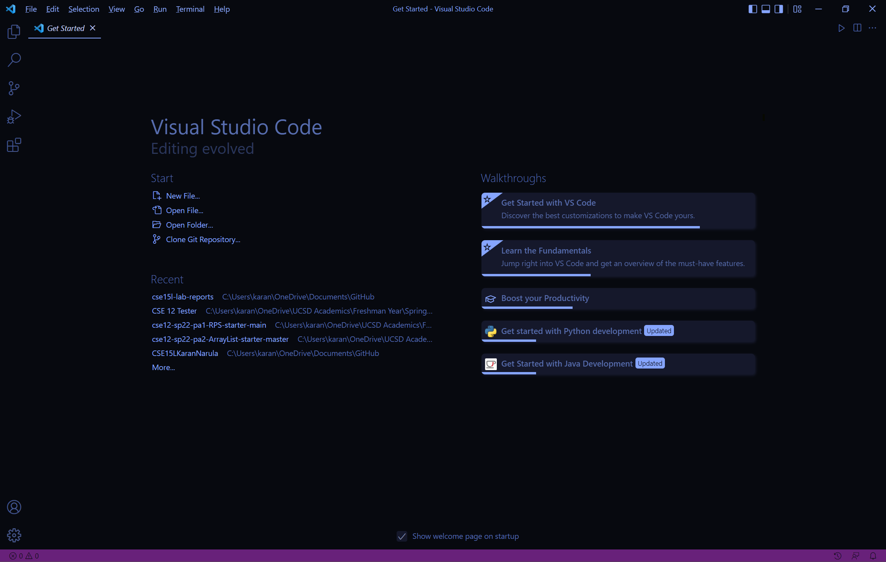
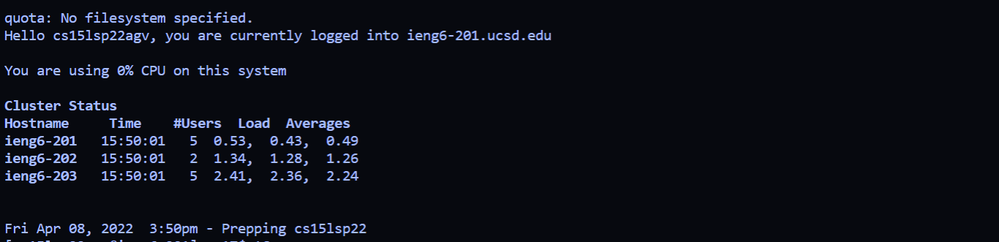
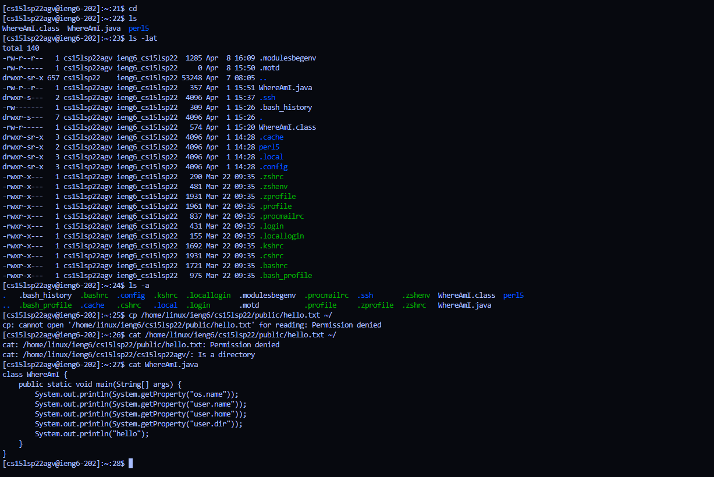
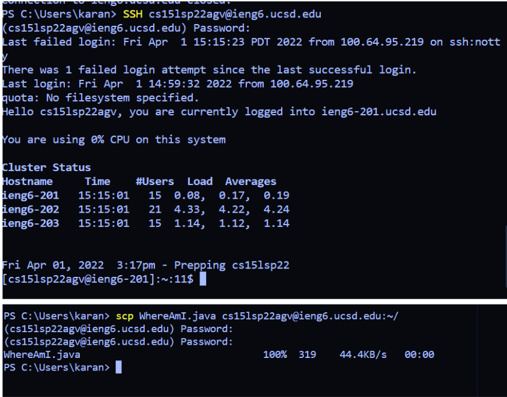
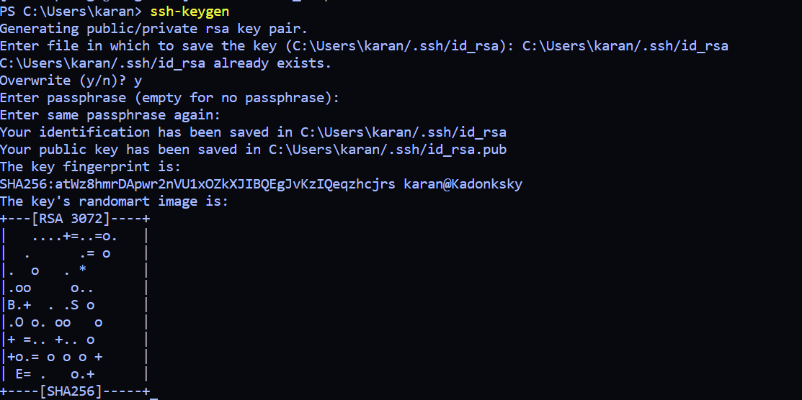
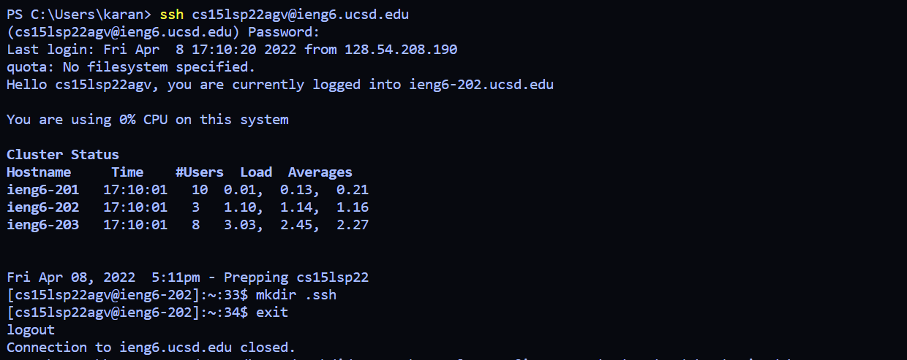
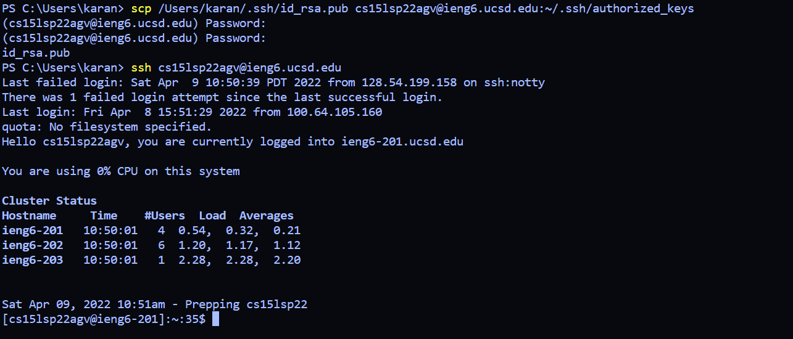
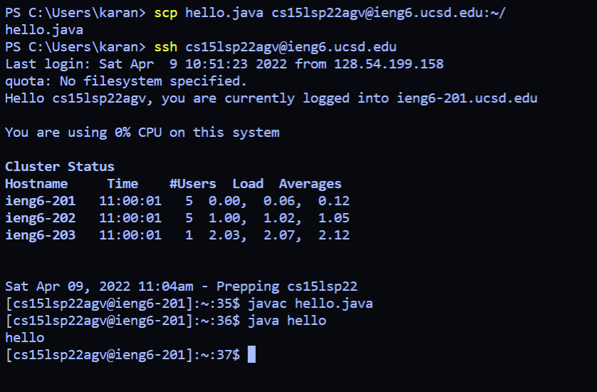

# Lab Report 1: Remote Access!

This is a brief tutorial on how to install VScode and access course specific content for the CSE 15L lab 1.

## Step 1: Installing VScode
* Download VScode by clicking the link [here](https://code.visualstudio.com/).
* Follow all the steps given on the website to install it and then startup VScode.
* You should find a screen that looks quite similar to this:

 
* Congratulations! You've successfully downloaded VScode!

## Step 2: Remotely connecting
* Before you remotely connect to the UCSD, server, it is recommended to download the openSSH software which you can download from this [link](https://docs.microsoft.com/en-us/windows-server/administration/openssh/openssh_install_firstuse).
* Open the terminal on VScode and input the following command:

    `ssh cs15lsp22zz@ieng6.ucsd.edu`
* If this is the first time you are connecting to the server it will ask you which essentially asks you if you trust the server; You should reply yes to it
* It will next ask you to enter the password for the server. Upon successful connection, you should see something like this:

 

## Step 3: Trying some commands
* We have access now to a wide range of commands to allow us to carry out different functions. Some of the important ones are:
    1. cd: changes the current working directory
    2. ls: lists the content of the directory
    3. cp: copies files and directories
    4. cat: it allows us to view the content of a given file.
* A sample of running some commands is shown below:

 

## Step 4: Moving files over With the scp command
* The scp command allows the transfer of files between two computer(unix or non-unix)
* You can use it to transfer files between your local and remote computer to have the files available on another server
* You can also use it to run your files on a more powerful computer with more resources available.

 

## Step 5: Setting an SSH key
* To setup the SSH key, you need to use a function called `ssh-keygen`
* This creates a public and private key
* It will ask you to input a passphrase and if you don't want to put in any passkey, you can simply press enter when the terminal asks for these inputs
* upon successful creation, you should see output similar to this:

 
* Now copy the public key from your local computer onto your virtual computer using the scp function and making a directory called `.ssh`
* The steps are shown below in the images

 

 
* As you can see in the second image, we logged into our SSH server without a passphrase

## Step 6: Optimizing remote running
* With the SSH key, we can now transfer files between our computers in a far more time efficient manner
* As seen below, the steps to transfer files between two computers has greatly reduced:

 

 __And that is all you need to get started to work on SSH!__

