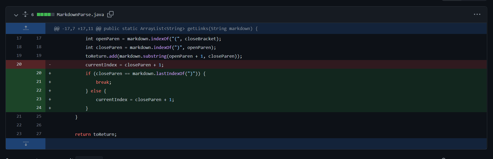
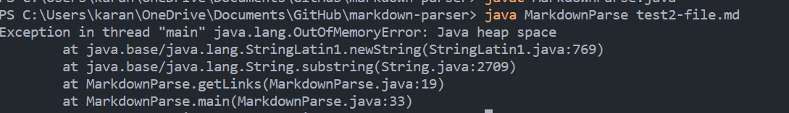
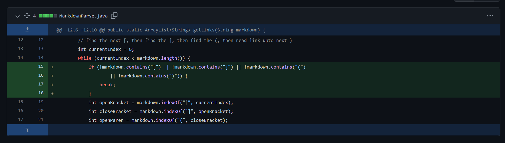
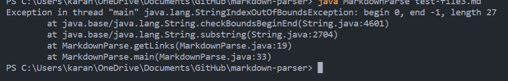
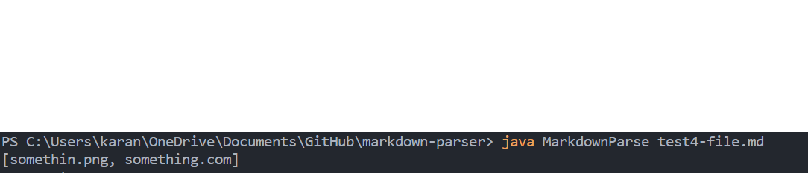

# Lab Report 2: Debugging MarkdownParse!

In this lab report, I will be covering three code changes I made to the MarkdownParse program to make it function more correctly.

## Presence of a string after the last link.

Link to the failure inducing file: [https://github.com/knarula2099/markdown-parser/blob/main/test-file2.md](https://github.com/knarula2099/markdown-parser/blob/main/test-file2.md)

The bug in this code is that it is never able to reach the end of the while loop and runs continuously and eventually leads to a heap space error where in the all the resources to run the code get exhausted.

## Absence of a link, but presence of parenthesis

Link to failure inducing file:[https://github.com/knarula2099/markdown-parser/blob/main/test-file3.md](https://github.com/knarula2099/markdown-parser/blob/main/test-file3.md)

This code change aims to correct if the markdown file contains parentheses but does not have a link. The test file contains just some sentences and a [], but no link inside. So to address this, i added the code diff that checks whether the file contains all the required parentheses to create a link in markdown. With this, if it does not contain any of the required parentheses, it will break the code.
## Image causing the code to parse image file URL's as a link

Link to failure inducing file:[https://github.com/knarula2099/markdown-parser/blob/main/test4-file.md](https://github.com/knarula2099/markdown-parser/blob/main/test4-file.md)

Checks if the file to be parsed through has image links and ignores them when returning the array. Now only website URL links should be returned. Originally, the code would not be able to distinguish whether it was a url being linked or an image. What the code change does is it identifies the presence of a `!` which is the indication of an image being linked. With this, it will only take links and ignore images.

