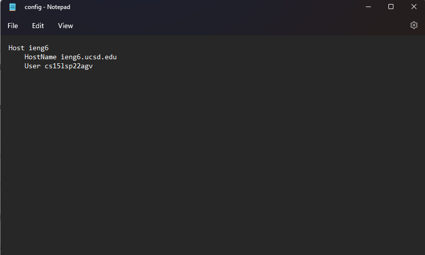
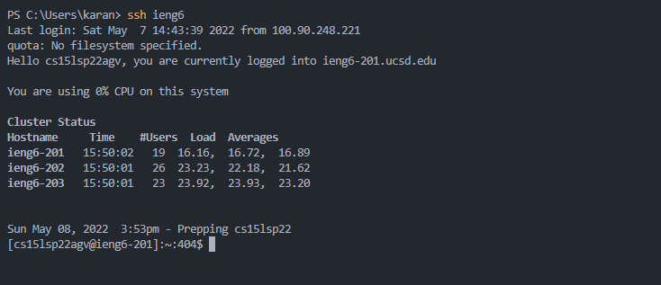
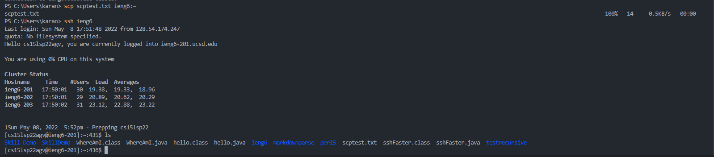
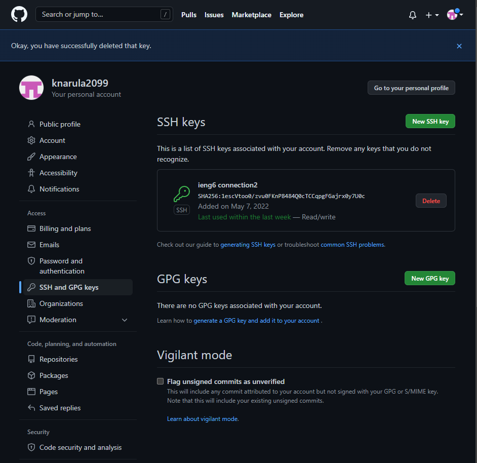
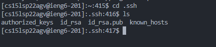
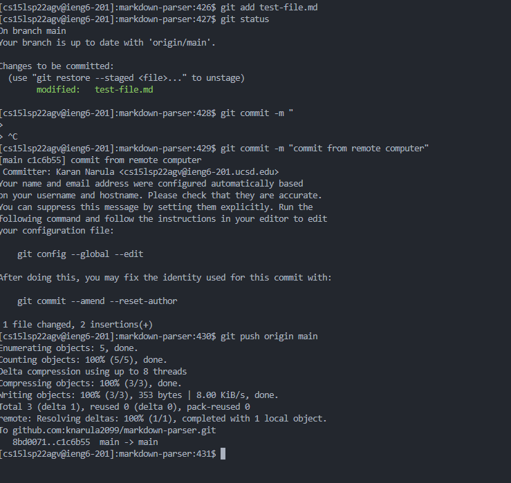
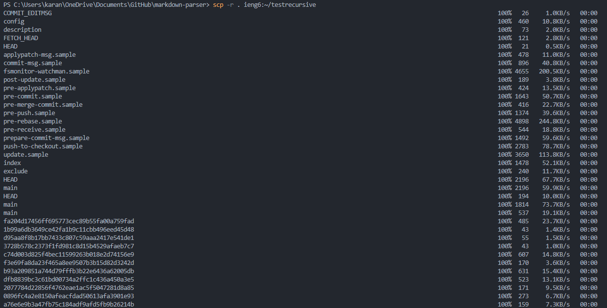
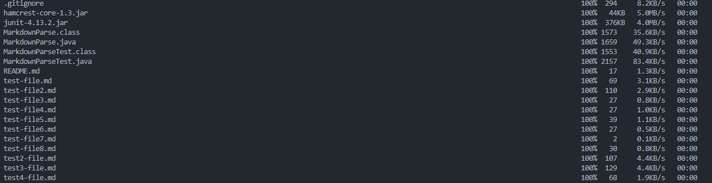
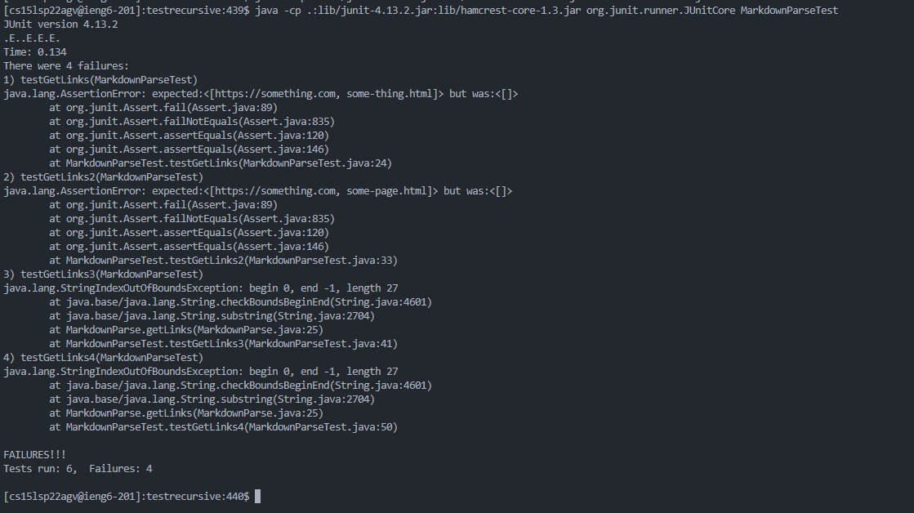

# Lab Report 3: Working on more efficient coding techniques

In this lab report, I will be covering the three optional exercises we did in the previous lab.

## Streamlining SSH configuration

Here is the config file and it was edited in notepad(or any text editor)

Now I can just use the alias `ieng6` to carry out functions like copying files from my local to remote computer.

## Setting up github access from ieng6

The private key is stored in the SSH directory on my user folder

Here is me making a commit from the remote server

This is a link to the commit [https://github.com/knarula2099/markdown-parser/commit/c1c6b551f5270f3fee828c8a5141141b8fe2d0d0](https://github.com/knarula2099/markdown-parser/commit/c1c6b551f5270f3fee828c8a5141141b8fe2d0d0)
## scp recursive

We can now run these files on  the remote computer

We can streamline this further by combining the steps as shown below.
