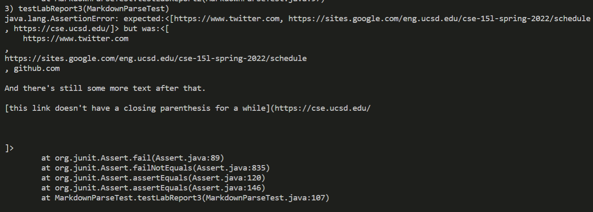

# Lab Report 4: Testing MarkdownParse!

In this lab report, I will be testing the MarkdownParse program that I developed, and the one my group carried out a review for in the week 7 Lab.

## Testing the codes
**[Link to my repository](git@github.com:knarula2099/markdown-parser.git)**

**[Link to reviewed repository](https://github.com/henrigy/markdown-parser.git)**
### Snippet 1
The given markdown file should produce:

The test I made for this:

The result on my code:

The result on the peer reviewed code:

* The above test can be resolved by adding a conditional that checks for the presence of backticks. On a cursory level, this can be done by checking the positioning of the backticks. If they start before square brackets, then the code should ignore the link, otherwise it should read it in as a link

### Snippet 2
The given markdown file should produce:

The test I made for this

The result on my code:

The result on the peer reviewed code:

* The output on my code led to an index out of bounds exception, but on the peer review code, it was simply a matter of correcting the parentheses. Correcting the peer-review code will be a far easier task as it is already on the right track. We could potentally use a stack to track the parentheses and check that they are being correctly placed. On the other Hand, my own code will need a much larger code change to address the issue.

### Snippet 3
The given markdown file should produce:

The test I made for this

The result on my code:

The result on the peer reviewed code:

* Both my code and the peer-review code fail in the same way. The code includes spaces that are in the link which should ideally be ignored by the parser and also, fails to ignore if a link goes on for a long sentence and includes another link within itself. I think this implementation will require a code change longer than 10 lines that wil use a stack to address  unmatched brackets like in snippet 2, plus a code change to ignore the spaces within the link environment.