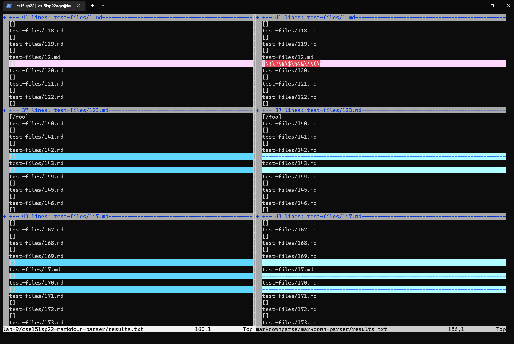
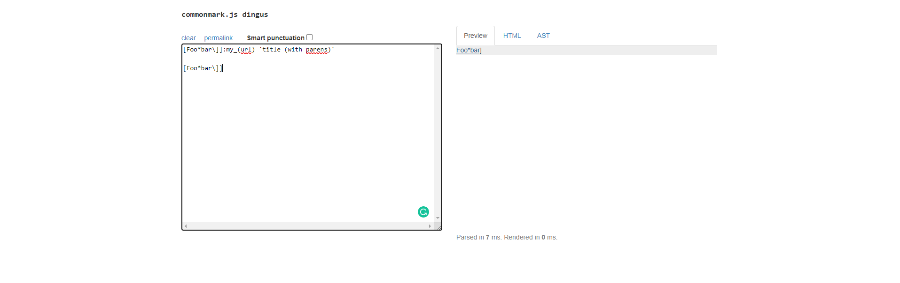
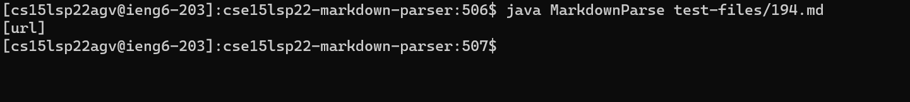
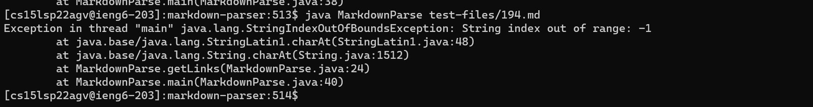

# Lab Report 5: Testing MarkdownParse!(Continued!)

In this lab report, I will be exploring differences between my implementation of markdownparse and the implementation we worked on in lab 9 given by the course staff.

## Identifying the differences
We can identify the differences between the two results of MarkdownParse running using vimdiff as shown below.

## Test case 1
[Link to the Test Case 194](https://github.com/knarula2099/markdown-parser/blob/main/test-files/194.md)
The expected output for this test case is:

The link on this file is `title (with parens)`
The output for the lab 9 version of MarkdownParse was:

The output for my version of MarkdownParse was:
