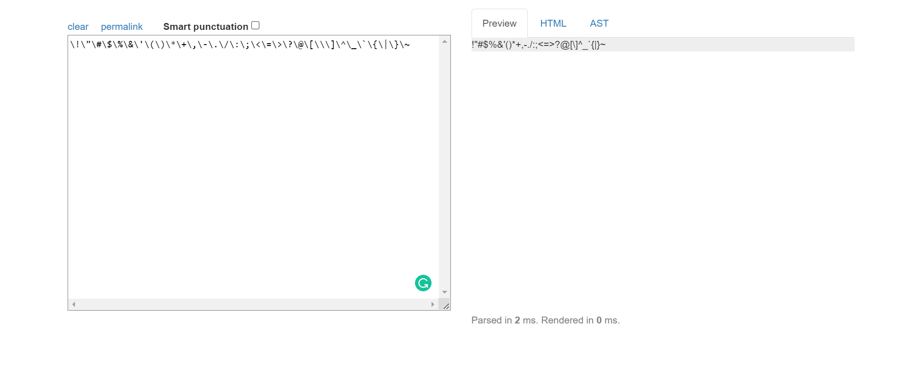
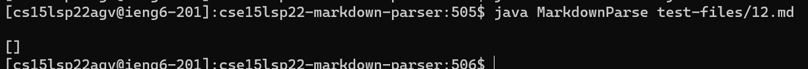
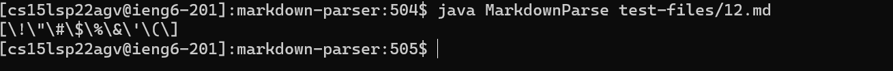

# Lab Report 5: Testing MarkdownParse!(Continued!)

In this lab report, I will be exploring differences between my implementation of markdownparse and the implementation we worked on in lab 9 given by the course staff.

## Identifying the differences
We can identify the differences between the two results of MarkdownParse running using vimdiff as shown below.

## Test case 1
[Link to the Test Case 194](https://github.com/knarula2099/markdown-parser/blob/main/test-files/194.md)

The expected output for this test case is:

The link on this file is `title (with parens)`
The output for the lab 9 version of MarkdownParse was:

The output for my version of MarkdownParse was:

Neither my implementation, nor the lab-9 implementation yield the correct expected output which was mentioned above.
This can be corrected in my version of the code by adding another condition to my code that checks for the position of certain necessary characters.

The code snippet above is designed to make sure that an image link is not considered in the url, but in this case, it causes an out of range error because the opening bracket is at index 0. A condition that ensures that the position of openbracket is not less than or equal to 0. This should prevent the above error from happening.
## Test case 2
As per my evaluation, most if not all my tests had a StringIndexOutOfBounds Exception for all of my test cases that had a different output than the lab-9 program or just in general, but these errors happened in slightly different places. So the second test case I chose was test file 12 which yielded different outputs for both markdownparses.
[Link to Test Case 12](https://github.com/knarula2099/markdown-parser/blob/main/test-files/12.md)
The expected output is: 

There is no link identified on this file according to the online runner
The output for the lab 9 version of MarkdownParse was:

The output for my version of MarkdownParse was:

My implementation returned the wrong value for the test case whereas the lab9 returned the correct output. This will probably need an indepth analysis of why my code was wrong.